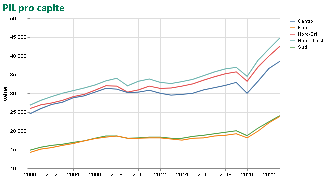
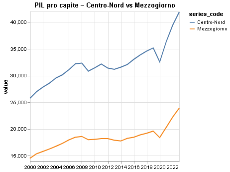
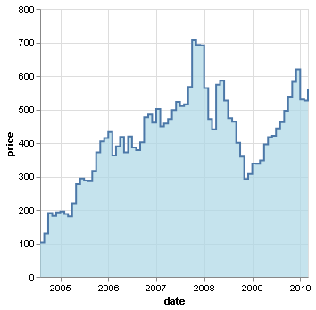

# [DBNomics Eurostat](https://db.nomics.world/Eurostat)

- https://opendata.marche.camcom.it/eurostat.htm

piattaforma open-source e open-data che raccoglie e rende disponibili gratuitamente dati economici provenienti da decine di fonti ufficiali, tra cui Eurostat (statistica dell’UE)

L’obiettivo è offrire un punto di accesso unificato ai dati economici, con API standardizzate e strumenti per analisi automatizzate.

I dati sono suddivisi in grandi temi statistici, tra cui:

- Economia e finanza
- Condizioni sociali e demografia
- Energia e ambiente
- Agricoltura
- Trasporti
- Innovazione e tecnologia

Ogni dataset include anche metadati (unità di misura, frequenza, copertura geografica, ecc.).

DBnomics mette a disposizione diversi strumenti per sviluppatori e analisti:

- API REST per accedere ai dati via HTTP
- Client Python (dbnomics): GitHub Python Client
- Client Stata: utile per analisi econometriche e panel data (vedi guida)

- jupyter nbconvert eurostat.ipynb --to html --no-input per avere un output HTML senza codice
- jupyter nbconvert --to html Eurostat.ipynb per avere HTML full
- jupyter nbconvert eurostat.ipynb --to html --embed-images rimangono interattivi
- voila eutostat.ipynb 
    - ✅ Mostra solo output e widget, non mostra nessuna cella di codice
    - ✅ Perfetto per presentazioni o pubblicazioni web

## le 2 pagine dedicate

- [senza codice](https://paolovolterra.github.io/DBNomics/eurostat.html)
- [con codice](https://paolovolterra.github.io/DBNomics/Eurostat_full.html)

## [PIL|GDP](https://db.nomics.world/Eurostat/NAMQ_10_GDP?tab=list)

- Gross domestic product (GDP) and main components per capita
- Gross domestic product (GDP) and main components per capita
- Gross domestic product (GDP) at current market prices by metropolitan region
- Gross domestic product (GDP) at current market prices by NUTS 2 region
- Gross domestic product (GDP) at current market prices by NUTS 3 region
- Gross domestic product (GDP) at current market prices by other typologies
- Gross domestic product (GDP) at market prices - annual data
- Gross domestic product (GDP) at market prices - quarterly data
- Gross domestic product at market prices

### annuale NAMA_10_GDP
- https://db.nomics.world/Eurostat/NAMA_10_GDP?dimensions=%7B%22geo%22%3A%5B%22IT%22%5D%2C%22freq%22%3A%5B%22A%22%5D%2C%22unit%22%3A%5B%22CP_MEUR%22%5D%2C%22na_item%22%3A%5B%22B1GQ%22%5D%7D&tab=list
- https://api.db.nomics.world/v22/series/Eurostat/NAMA_10_GDP/A.CP_MEUR.B1GQ.IT?format=csv&observations=1

Usa nama_10r_2gdp se stai analizzando aree geografiche ampie, es.:
- confronto Centro-Nord vs Mezzogiorno
- analisi su 20 regioni italiane (NUTS 2) o confronti tra Stati europei

Usa nama_10r_3gdp se ti servono dati a livello provinciale o metropolitano, es.:
- Torino, Milano, Palermo, ecc.
- politiche locali, ZES, fondi di coesione a livello sub-regionale

## nama

- nama_10_gdp: PIL nazionale
- nama_10r_2gdp: PIL regionale (NUTS2)
- nama_10r_3gdp: PIL provinciale (NUTS3)
- nama_10r_2hhinc: Reddito disponibile per regione

## namq
- namq_10_gdp: PIL trimestrale per componenti
- namq_10_a10: Valore aggiunto per attività economica trimestrale
- namq_10_nf_tr: Reddito e trasferimenti trimestrali

